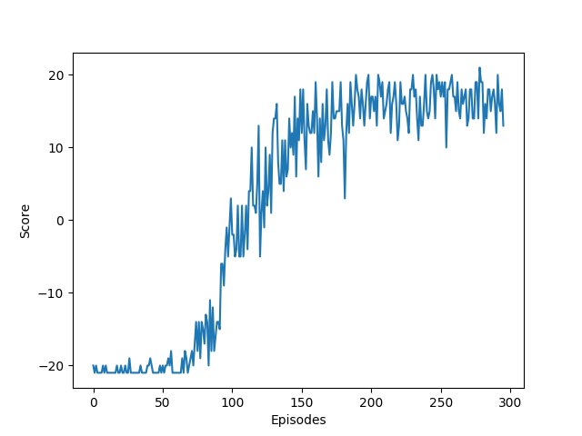
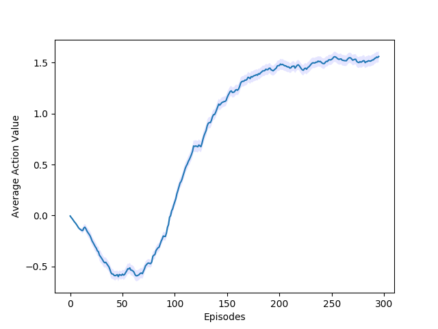

# QDN-pytorch

This is a PyTorch implementation of DQN from [Human-level control through deep reinforcement learning](https://www.nature.com/nature/journal/v518/n7540/full/nature14236.html).

## Results

